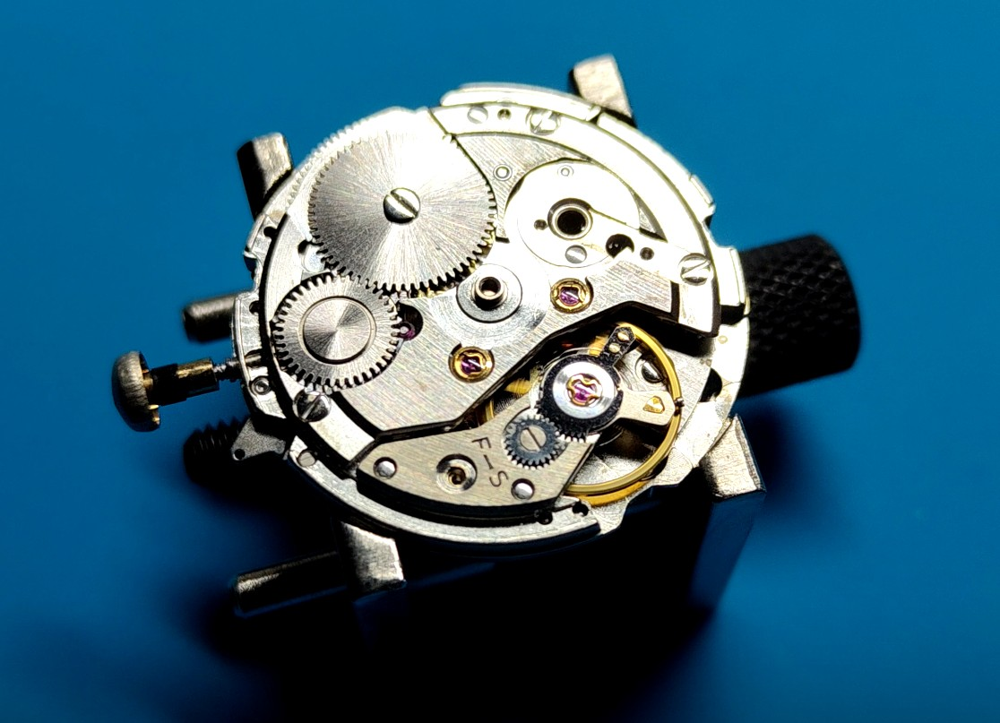
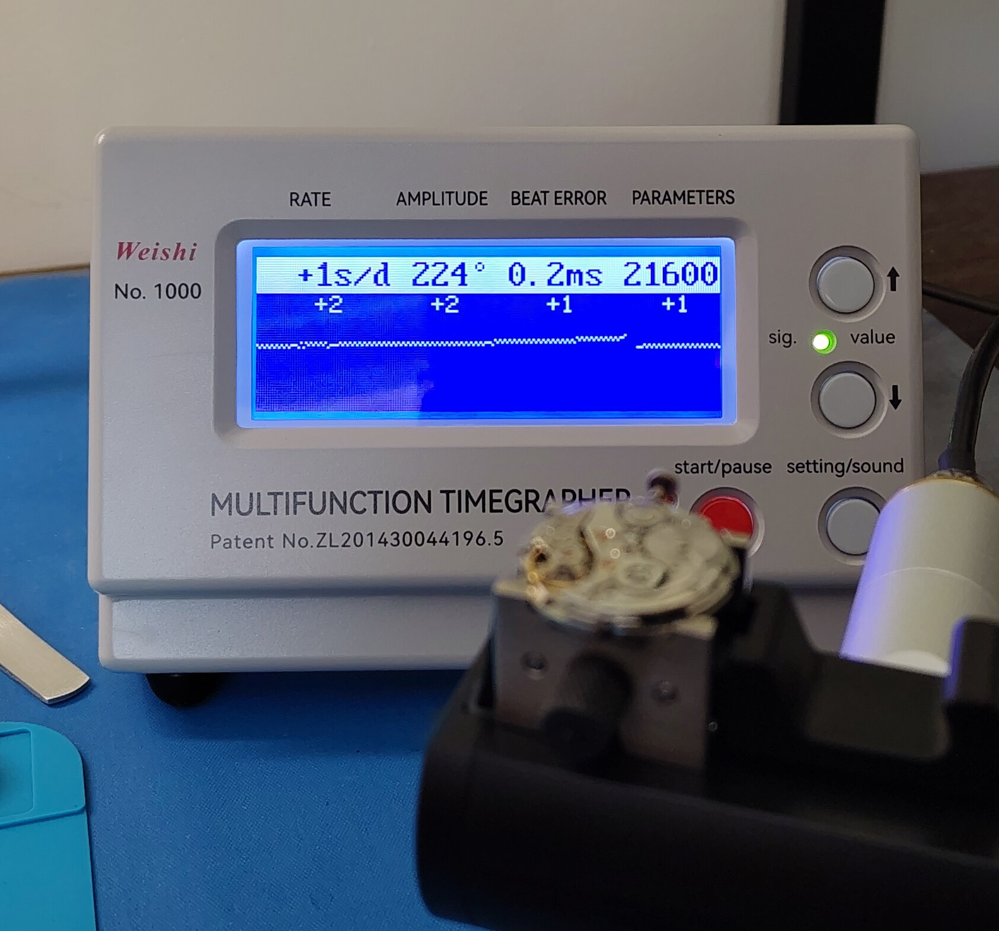
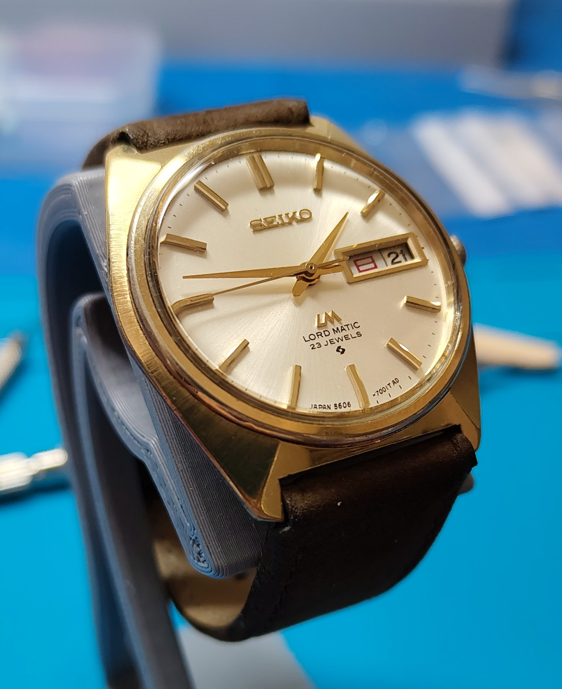
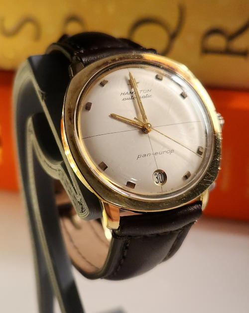
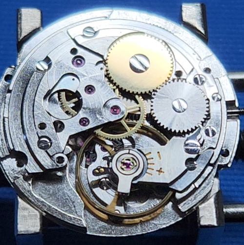
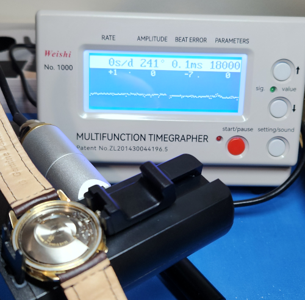

I like to fix watches. Occasionally, I'm successful. 

# April 2026 - Seiko LM 5606-7000
Why does this 55 year old auto run better and more accurately than my new 6R55 Prospex? Overall surprisingly easy build, if you don't drop bits on the floor. The crystal *will* come out with a Bergeon 4266, despite what the manual says.

# February 2026 - Hamilton PanEurop H63
A beautiful movement from a stunning watch. Almost beginner friendly and suspiciously easy to get it running to near-COSC standard. The calendar set mechanism, however, was designed by the devil. Take lots of pictures and triple check... I put the tensioner spring in back-to-front and nearly bricked the mechanism.

